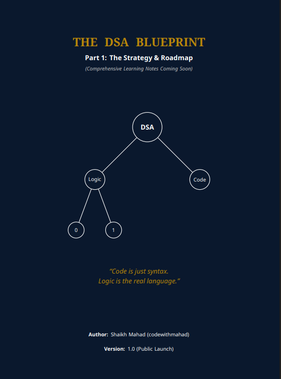
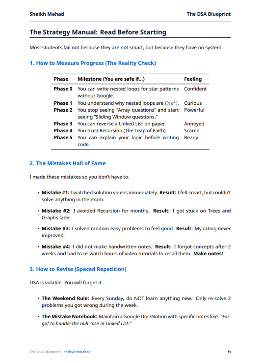
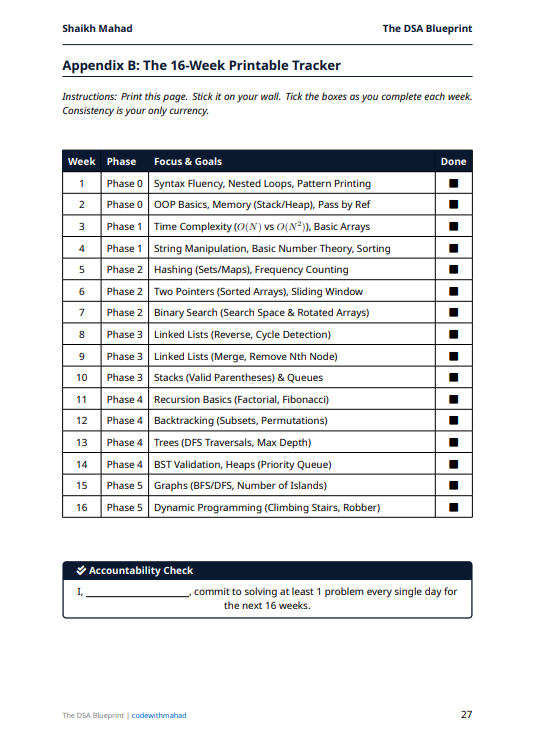

  
  

  <h2 style="margin-top: 0;">The Strategic Roadmap for CS Students</h2>
  
  

    A structured mentor guide to bridge the gap between "Learning Syntax" and "Cracking Interviews."
     
    <b>No fluff. No confusion. Just the path.</b>
  

   

  

    

  

    
    &nbsp;&nbsp;&nbsp;
    
    &nbsp;&nbsp;&nbsp;
    
  

 

## 🧐 Why This Exists?

Most students have the syllabus, but they lack the **strategy**.
I spent my semester break analyzing top resources, filtering out the noise, and organizing everything into a clear, step-by-step path.

> **This is not just a list of links.** It is a **29-Page Guidebook** that acts as your mentor for the semester.

 

  <h2>📸 Inside the Blueprint</h2>
  
<i>A visual sneak peek into the PDF structure.</i>

   
  
  
  &nbsp;&nbsp;&nbsp;
  
  &nbsp;&nbsp;&nbsp;
  

 

## ⚡ What You Get

This document covers the entire lifecycle of learning Data Structures & Algorithms:

* ✅ **Phase 0 (Prerequisites):** The "Gatekeeper" problems you must solve before touching DSA.
* ✅ **The 6-Phase Roadmap:** From Arrays to Dynamic Programming, arranged in the correct logical order.
* ✅ **Resource Vault:** Highly curated links to the best tutorials (Striver, NeetCode) so you don't waste time searching.
* ✅ **The "Mistakes Hall of Fame":** Common student errors (like ignoring Recursion) and how to avoid them.
* ✅ **16-Week Printable Tracker:** A physical sheet to stick on your wall and track consistency.
* ✅ **University Exam Hacks:** Specific patterns often asked in Lab Tasks and Vivas.

 

## ☕ Buy Me a Chai (Appreciation)

I created this Blueprint completely **Free** and **Open Source** because I believe quality guidance should be accessible to every student.
If this roadmap saves you time or clears your confusion, you can say **"Thanks!"** by buying me a chai. It keeps the motivation high! ❤️

   
  <table>
    <tr>
      <td align="center" width="350" style="border-right: 2px solid #eee;">
        <h3 align="center">📱 Quick Scan</h3>
         
        
          
        <b>Easypaisa / JazzCash</b>
      </td>
      <td width="500" valign="middle" style="padding-left: 40px;">
        <h3 align="center">🏦 Direct Transfer</h3>
        
Prefer using your banking app? Copy the IBANs below:

         
        <table align="center">
          <tr>
            <td></td>
            <td><code>PK72TMFB0000000086282384</code></td>
          </tr>
          <tr>
            <td></td>
            <td><code>PK03JCMA2302923148068959</code></td>
          </tr>
        </table>
         
        
<i>💡 <b>Reference:</b> "DSA Appreciation"</i>

      </td>
    </tr>
  </table>

 

  <h2>👤 About the Author</h2>
  
Hi, I'm **Shaikh Mahad** (`codewithmahad`). I am a CS student passionate about building the resources I wish I had when I started.

  
   

  

    
    &nbsp;&nbsp;&nbsp;
    
  

   
  
  

    <b>Developed with ❤️ for the Community.</b> 
    © 2025 The DSA Blueprint — Open Source MIT License
  

